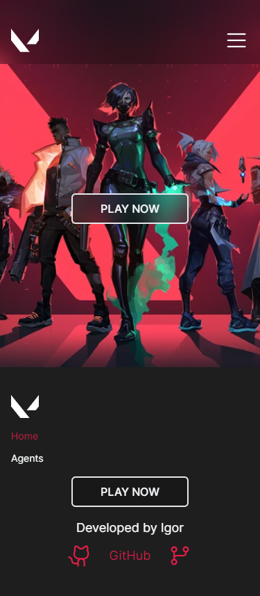
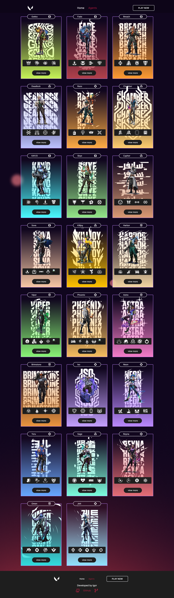
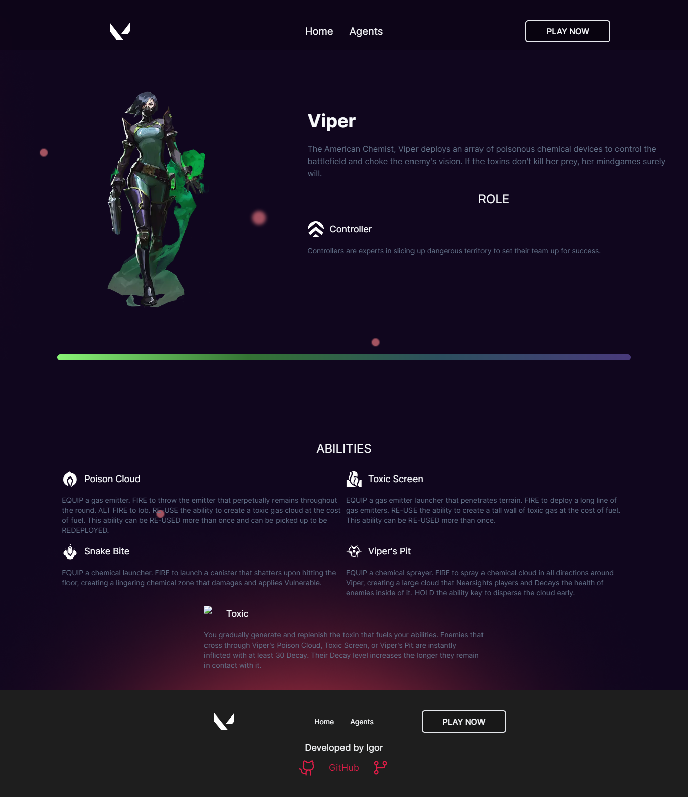

# Valorant Hub

Explore the universe of Valorant agents with Valorant Hub, a platform that delves deep into the stories, abilities, and statistics of each character in the game.

## Objective for carrying out the project

Understanding the entire structure and functioning of Next.js, with a focus on comprehending the system of routes, Server, and Client Components. Additionally, the application and functioning of Tailwind CSS style classes.

## Interface preview

## Technologies

-   Next.js
-   TypeScript
-   Tailwindcss

## User-Facing Features

-   Responsive design
-   Navbar
-   Multiple pages

## Developer-Centric Resources

-   Code formatting with Eslint and Prettier
-   Absolute Imports
-   SEO

## Deploy

-   [Access Valorant Hub](https://valorant-hub-ig.vercel.app/)

## How to Use

-   Clone this repository to your computer
-   Install dependencies using the command: `pnpm i`
-   Start the development server with: `pnpm dev`
-   Open your browser and navigate to host to view: `http://localhost:3000/`
